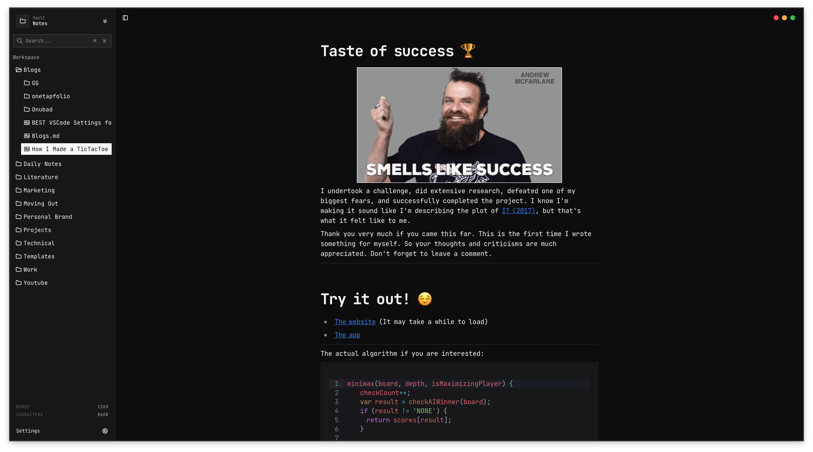

<div align="center">
  
  <h1>Yana (Yet Another Note App)</h1>
  <p><strong>Boring by design. Fast by nature. Markdown to the core.</strong></p>

  <p>
    <a href="MANIFESTO.md">Read the Manifesto</a>
  </p>
</div>

---



## About Yana

Yana is a simple, open-source, markdown-based note-taking app designed for people who just want to write. In a world full of bloated note-taking applications with endless plugins and proprietary formats, Yana stays out of your way.

### Why Yana?

- **Markdown as the Source of Truth**: Standard markdown syntax. No proprietary blocks. Your notes remains yours, readable anywhere.
- **No Plugin Overload**: Features that matter are built-in. No more wasting time browsing marketplaces.
- **Fast & Lightweight**: At ~12MB, Yana is light on resources and fast to open.
- **Open Source**: Licensed under MIT. Clone it, fork it, make it yours.

---

## Getting Started

### Prerequisites

- [Bun](https://bun.sh/) (Recommended) or Node.js

### Development

First, install dependencies:

```bash
bun install
```

Then, run the app:

```bash
bun tauri dev
```

### Build

To build the Tauri application:

```bash
bun tauri build
```

---

## Tech Stack

- **Framework**: [Next.js](https://nextjs.org)
- **Editor**: [Milkdown](https://milkdown.dev/) (Crepe)
- **Desktop**: [Tauri](https://tauri.app/)
- **Styling**: Tailwind CSS
- **Icons**: [Tabler Icons](https://tabler-icons.io/)

---

<div align="center">
  Made with ❤️ by <a href="https://github.com/ikramhasan">Ikram Hasan</a>
</div>

